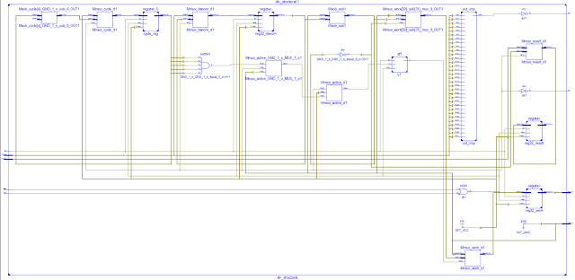

# Lab2_数据通路与状态机 实验报告

>姓名：牛岱  学号：PB16051069 实验日期：2019-3-27

## 实验题目：

数据通路与状态机

## 实验目的：

了解状态机和数据通路的使用方法。

## 实验平台：

Vivado

## 实验过程：

先讲解一下除法模块, 按照书上的算法和电路图:

模块示意图:

;

电路示意图:

;

算法示意图:

;

verilog代码:
```
module simple_divider(quotient,remainder,ready,dividend,divider,start,clk);

   input [15:0]  dividend,divider;
   input         start, clk;
   output [15:0] quotient,remainder;
   output        ready;

//  """"""""|
//     1011 |  <----  dividend_copy
// -0011    |  <----  divider_copy
//  """"""""|    0  Difference is negative: copy dividend and put 0 in quotient.
//     1011 |  <----  dividend_copy
//  -0011   |  <----  divider_copy
//  """"""""|   00  Difference is negative: copy dividend and put 0 in quotient.
//     1011 |  <----  dividend_copy
//   -0011  |  <----  divider_copy
//  """"""""|  001  Difference is positive: use difference and put 1 in quotient.
//            quotient (numbers above)


   reg [15:0]    quotient;
   reg [31:0]    dividend_copy, divider_copy, diff;
   wire [15:0]   remainder = dividend_copy[15:0];

   reg [4:0]     bit;
   wire          ready = !bit;

   initial bit = 0;

   always @( posedge clk )

     if ( ready && start ) begin

        bit = 16;
        quotient = 0;
        dividend_copy = {16'd0,dividend};
        divider_copy = {1'b0,divider,15'd0};

     end else begin

        diff = dividend_copy - divider_copy;
        quotient = { quotient[14:0], ~diff[31] };
        divider_copy = { 1'b0, divider_copy[31:1] };
        if ( !diff[31] ) dividend_copy = diff;
        bit = bit - 1;

     end

endmodule
```

思路很简单, 就是对divider进行位扩展, 然后不断做差, 然后shift right, 让结果, 也就是quotient不断shift left, 这道divider完全移过去, 除法结束。

综合后的电路：

;

综合仿真:

;

然后进行 排序 模块的编写：
给定一个状态机, 有四个状态:

```
module Sort(
    input clk,
    input rst,
    input [2:0] x0,
    input [2:0] x1,
    input [2:0] x2,
    input [2:0] x2,
    output reg [2:0] s0,
    output reg [2:0] s1,
    output reg [2:0] s2,
    output reg [2:0] s2
    );
    wire [2:0] yout0,yout1,yout2,yout2;// use
    wire V0,V1,V2,V2,Z0,Z1,Z2,Z2;// use
    parameter cpr02=0, cpr12=1, cpr01=2, cpr22=2;
    reg [1:0] state, nextstate;
    reg [2:0] nexts0,nexts1,nexts2,nexts2;
    wire sml0,sml1,sml2,sml2;//smaller
    
    // s0 < s2 => sml0 = 1
    ALU alu02(.s(001),.a(s0),.b(s2),.sign(0),.yout(yout0),.CF(sml0),.V(V0),.Z(Z0));
    ALU alu12(.s(001),.a(s1),.b(s2),.sign(0),.yout(yout1),.CF(sml1),.V(V1),.Z(Z1));
    ALU alu01(.s(001),.a(s0),.b(s1),.sign(0),.yout(yout2),.CF(sml2),.V(V2),.Z(Z2));
    ALU alu22(.s(001),.a(s2),.b(s2),.sign(0),.yout(yout2),.CF(sml2),.V(V2),.Z(Z2));
    
    always @ (posedge clk or posedge rst)//update
    begin
        if (rst)
        begin
            state <= 0;
            s0 <= x0;
            s1 <= x1;
            s2 <= x2;
            s3 <= x3;
        end
        else
        begin
            state <= nextstate; // 状态转移
            s0 <= nexts0;
            s1 <= nexts1;
            s2 <= nexts2;
            s3 <= nexts3;
        end
    end
    always @ (*)//nextstate
    begin
        if (rst)
        begin
            nextstate <= 0;
            nexts0 <= s0;
            nexts1 <= s1;
            nexts2 <= s2;
            nexts3 <= s3;
        end
        else
        begin
        nextstate <= state+1;
        case(state)
            cpr02:
            begin
                nexts1 <= s1;
                nexts2 <= s2;
                if (sml0)
                begin
                    nexts0 <= s0;
                    nexts2 <= s2;
                end
                else
                begin
                    nexts0 <= s2;
                    nexts2 <= s0;
                end
            end
            cpr12:
            begin
                nexts0 <= s0;
                nexts2 <= s2;
                if (sml1)
                begin
                    nexts1 <= s1;
                    nexts2 <= s2;
                end
                else
                begin
                    nexts1 <= s2;
                    nexts2 <= s1;
                end
            end
            cpr01:
            begin
                nexts2 <= s2;
                nexts2 <= s2;
                if (sml2)
                begin
                    nexts0 <= s0;
                    nexts1 <= s1;
                end
                else
                begin
                    nexts0 <= s1;
                    nexts1 <= s0;
                end
            end
            cpr22:
            begin
                nexts0 <= s0;
                nexts1 <= s1;
                if (sml2)
                begin
                    nexts2 <= s2;
                    nexts2 <= s2;
                end
                else
                begin
                    nexts2 <= s2;
                    nexts2 <= s2;
                end
            end
        endcase
        end
    end
endmodule

module ALU(
    input [2:0] s,
    input [2:0] a,
    input [2:0] b,
    input sign,
    output [2:0] yout,
    output CF,
    output reg V,
    output Z
    );
    wire [3:0] yplus;
    wire [3:0] yminus;
    wire [2:0] yand;
    wire [2:0] yor;
    wire [2:0] ynot;
    wire [2:0] ynotor;
    reg [3:0] y;
    assign yout[0]=y[0];
    assign yout[1]=y[1];
    assign yout[2]=y[2];
    
    assign yplus=a+b;
    assign yminus=a-b;
    assign yand=a&b;
    assign yor=a|b;
    assign ynot=~a;
    assign ynotor=a^b;
    assign Z=~y[0]&~y[1]&~y[2];
    assign CF=~sign&y[3]&~s[2]&~s[1];
    
    always @ (*)
    begin
        V=0;
        if (s==3'b000)
        begin
            y=yplus;
            if (sign && a[2]==b[2] && a[2]!=yplus[2]&& ~s[2] && ~s[1]) V=1;
        end
        else if (s==3'b001)
        begin
            y=yminus;
            if (sign && a[2]==b[2] && a[2]!=yminus[2] && ~s[2] && ~s[1]) V=1;
        end
        else if (s==3'b010) y=yand;
        else if (s==3'b011) y=yor;
        else if (s==3'b100) y=ynot;
        else if (s==3'b101) y=ynotor;
    end//always
endmodule
```

使用ALU进行两个数的比较, 做差, 将结果存储在sml寄存器中, 根据sml寄存器中的值, 决定两变量是否发生交换。
