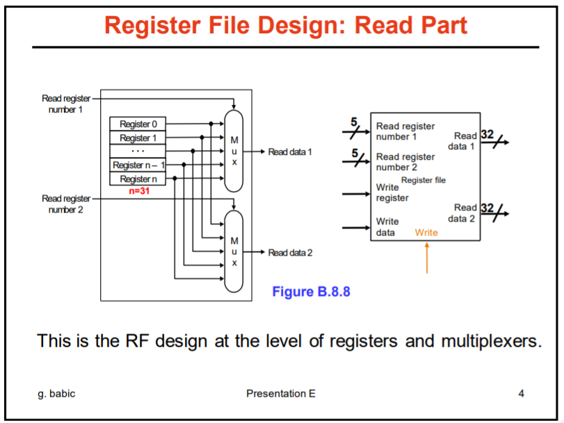

# Lab3	寄存器堆与计数器

>姓名：牛岱  学号：PB16051069 实验日期：2019-4-10

## 实验题目：

寄存器堆与计数器

## 实验目的：

了解寄存器堆与计数器的实现原理。

## 实验平台：

Vivado

## 实验过程：

## 寄存器堆

先讲解一下寄存器堆的实现:

寄存器堆是CPU中的一个重要组件, 它提供了寄存器的读写功能, 比如输入寄存器号, 输入寄存器的值, 或者更改某个寄存器的值。

寄存器堆的基本实现原理电路, 分成两块看, 第一块是寄存器值的读, 第二块是寄存器值的写:



寄存器的写:


在此基础上, 我们可以基于 verilog 写一个寄存器堆:

```
module RegisterFile #(
     parameter SIZE = 5,
     parameter RegNum = 3
) (R1, R2, W1, D1, We, clk, Out1, Out2);
input [RegNum-1:0] R1, R2; // Register #'s to Read
input [RegNum-1:0] W1; // Register to write to
input We;
input [SIZE-1:0] D1; // Date to write to W1
input clk;

output reg [SIZE-1:0] Out1, Out2; // Output data from R1 and R2;

reg [SIZE-1:0] rf [7:0]; // An array of 8 registers each of 32 bits

// aloways@(posedge clock) // if using a clock

always@(posedge clk) begin // build my sensitivity list for me
    // Check if write is enabled
    if (We)
        rf[W1] <= D1;

    // output data stored at R1 into Out1
    Out1 <= rf[R1];
    
    // output data stored at R2 into Out2
    Out2 <= rf[R2];
end

endmodule

```

这个模块的输入主要有 R1、 R2, 分别是要读的寄存器号, 然后 We 是写的使能, 如果它被置为 1 , 那么就启动写的功能, 然后将 D1, 也就是数据 Date 存到指定的寄存器中。

可以看到我们的always循环， 有一个 if（We）， 这个便是写， 然后我们每次都将编号为 R1 的寄存器通过 Out1 输出， R2 的寄存器通过 Out2 输出。

我写的 testbench：

```
module RegisterFileTest();
reg clk;
reg [2:0] R1, R2;
reg [2:0] W1;
reg We;
reg [31:0] D1;

wire [31:0] Out1, Out2;

RegisterFile rf(R1, R2, W1, D1, We, clk, Out1, Out2);
initial begin
clk = 0;
forever #2 clk=~clk;
end

initial begin
//R1 = 3'd1;
//R2 = 3'd2;
//#10;
W1 = 3'd3;
We = 1'b1;
D1 = 32'd15;
R1 = 3'd3;
#10;
end
endmodule
```
然后接下来是计数器的实现:

## 计数器

计数器的实现特别简单, 请看代码:

```
module Counter(input clk, reset, output[3:0] counter
    );
reg [3:0] counter_up;

// up counter
always @(posedge clk or posedge reset)
begin
if(reset)
 counter_up <= 4'd0;
else
 counter_up <= counter_up + 4'd1;
end 
assign counter = counter_up;
endmodule
```

就是每次时钟波动的时候, 都给counter的值加一, 如果reset的值变高, 那么就将 counter 置为初始默认值 0。

有了这两个模块之后， 我们可以开始 FIFO循环队列 的编写。

## FIFO循环队列

基本实现思想是用指针，一个 wp 指针， 一个 rp 指针， 当我从FIFO内存队列里读一个数据的时候， rp 加一， 写一个数据的时候， wp
加一， 那么wp - rp 就是我队列目前剩下的值的个数， 当 wp = rp的时候，说明目前FIFO队列为空， 如果 wp 比 rp 大一个循环， 说明此时FIFO 已经满了， 不能再往里存数据了，基于此将目前FIFO里面的数据显示在数码管上。


```
module fifo # (parameter abits = 3, dbits = 3)(
    input clock,
    input reset, 
    input wr, // wr 为1，就往fifo里面写数据
    input rd, // rd 为1，从fifo里面读一个数据出来
  input [dbits-1:0] din, // 要写入的数据
    output empty, // 表示fifo队列为空
    output full, // 表示队列已满
    output [dbits-1:0] dout, // 输出的寄存器的值
    output [abits-1:0] wp, // 刚才提到的表示写的指针
    output [abits-1:0] rp // 读的指针
    );
 
wire db_wr, db_rd;
reg dffw1, dffw2, dffr1, dffr2;
reg [dbits-1:0] out;
 
always @ (posedge clock) dffw1 <= wr; 
always @ (posedge clock) dffw2 <= dffw1;
 
assign db_wr = ~dffw1 & dffw2; // 防止按钮的重复震荡
 
always @ (posedge clock) dffr1 <= rd;
always @ (posedge clock) dffr2 <= dffr1;
 
assign db_rd = ~dffr1 & dffr2; //放置按钮重复震荡
 
 
reg [dbits-1:0] regarray[2**abits-1:0]; // 寄存器队列
reg [abits-1:0] wr_reg, wr_next, wr_succ; // 要写入的寄存器编号
reg [abits-1:0] rd_reg, rd_next, rd_succ; // 要读的寄存器编号
reg full_reg, empty_reg, full_next, empty_next;

assign wr_reg <= wp;
assign rd_reg <= rp;
 
assign wr_en = db_wr & ~full; // 当且仅当队列没有塞满数据且 wr 高电平的时候才能写数据
 
always @ (posedge clock)
 begin
  if(wr_en)
   regarray[wr_reg] <= din;  // 往编号为 wr-reg的寄存器里写输入的数据din
 
 end
  
always @ (posedge clock)
 begin
  if(db_rd)
   out <= regarray[rd_reg]; // 读寄存器， 输出
 end
  
 
always @ (posedge clock or posedge reset)
 begin
  if (reset)
   begin
   wr_reg <= 0;
   rd_reg <= 0;
   full_reg <= 1'b0;
   empty_reg <= 1'b1;
   end
   
  else
   begin
   wr_reg <= wr_next; // 创建 next 放置阻塞的发生
   rd_reg <= rd_next;
   full_reg <= full_next;
   empty_reg <= empty_next;
   end
 end
  
always @(*)
 begin
  wr_succ = wr_reg + 1; 
  rd_succ = rd_reg + 1;
  wr_next = wr_reg;
  rd_next = rd_reg;  
  full_next = full_reg; 
  empty_next = empty_reg; 
   
   case({db_wr,db_rd})
     
    2'b01:
     begin
      if(~empty)
       begin
        rd_next = rd_succ;
        full_next = 1'b0;
       if(rd_succ == wr_reg) 
         empty_next = 1'b1;  
       end
     end
     
    2'b10: //write
     begin
       
      if(~full) 
       begin
        wr_next = wr_succ;
        empty_next = 1'b0;
        if(wr_succ == (2**abits-1))
         full_next = 1'b1;   
       end
     end
      
    2'b11: 
     begin
      wr_next = wr_succ;
      rd_next = rd_succ;
     end
    endcase
    
 
 end
 
assign full = full_reg;
assign empty = empty_reg;
assign dout = out;
endmodule
```


